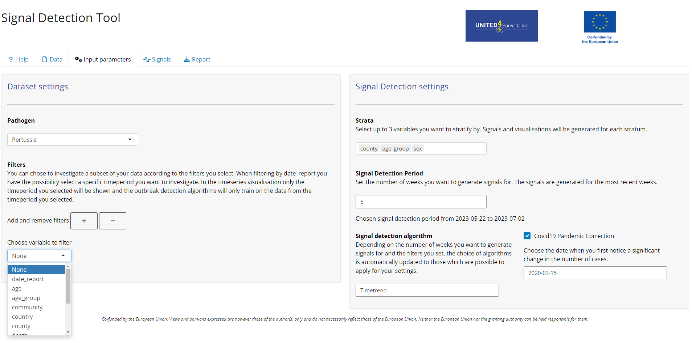

<!-- README.md is generated from README.Rmd. Please edit that file -->

```{r, include = FALSE}
knitr::opts_chunk$set(
  collapse = TRUE,
  comment = "#>",
  fig.path = "man/figures/README-",
  out.width = "100%"
)
```

# SignalDetectionTool

<!-- badges: start -->
<!-- badges: end -->
## Overview

A shiny app for automated detection of signals in infectious disease surveillance data. A signal is an anomaly in an infectious disease surveillance time series.  
This app allows the user to investigate generated signals and corresponding surveillance time series. It includes upload of csv or Excel files, data checks, possibility to set parameters for signal detection, visualisation of results and generation of reports. The tool is interactive and flexible so that it can be used in different contexts and customised to the user’s needs.

## Installation and running the app
 You can install the most recent release of the SignalDetectionTool from [GitHub](https://github.com/United4Surveillance/signal-detection-tool) with:

``` r
# install.packages("devtools")
devtools::install_github("United4Surveillance/signal-detection-tool")
```
To run the app you need to type:

``` r
library(SignalDetectionTool)
run_app()
```

Another way to install the tool is downloading the appropriate file found under [Releases](https://github.com/United4Surveillance/signal-detection-tool/releases).

<details>
  <summary><strong>Detailed installation guideline for the files in Releases.</strong></summary>
  
  <ul>
    <li>To navigate to the Release page, scroll up and look on the right-hand side of the page under a section labelled Releases. Click on 'Releases'</li>
    <li>You can find the latest tool release at the top of the page with the corresponding version number.</li>
    <li>There are three files you can download:</li>
    <ul>
      <li><b>Source code (tar.gz)</b>: This is a tarball. You must have Rtools installed on your computer to use this installation method. If you only want to run the app and use its functionalities this is the correct installation for you. In case you are interested to modify code of the app go to <b>Source Code (zip)</b>. </li>
      <li><b>SignalDetectionTool_x.x.x.zip</b>: This is a binary. You do not need to have Rtools installed on your computer to use this installation method. </li>
      <li><b>Source Code (zip)</b>: This is a zipped folder of the SignalDetectionTool repository. You must have Rtools installed on your computer to use this installation method. It can be unzipped and installed over the 'Build' tab in Rstudio. This can be used if you want to modify code of the app for your usage. Instead you can also just clone the repository.</li>
    </ul>
  </ul>

  <strong>Installation using .tar.gz</strong>
  <ul>
    <li>Download the provided .tar.gz file and save it on your computer</li>
    <li>Install the package <code>remotes</code> by putting <span style="color:blue;">install.package("remotes")</span> in the console</li>
    <li>Install the package dependencies for the SignalDetectionTool using the full path where you stored the .tar.gz file and replace the x.x.x with the current version of the binary. For example: <span style="color:blue;">remotes::install_deps("C:/Users/YourUsername/Downloads/SignalDetectionTool_x.x.x.tar.gz")</span></li>
    <li>Execute this command in the console</li>
    <li>This should also install any dependencies you need to run the tool. Wait until the installation finishes successfully</li>
    <li>Write the following command into the console to install the tool: <span style="color:blue;">install.packages("path_to_the_tool/SignalDetectionTool_x.x.x.tar.gz", repos = NULL, type="source")</span></li>
    <li>Continue to read 'Running the shiny application'</li>
  </ul>


<strong>Installation using SignalDetectionTool_x.x.x.zip file</strong>
 <ul>
<li>Download the provided zip file and save it on your computer and open RStudio</li>
<li>Install the package remotes by putting <span style="color:blue;">install.package("remotes")</span> in the console</li>
<li>Install the package dependencies for the SignalDetectionTool using the full path where you stored the .zip file and replace the x.x.x with the current version of the binary. For example: <span style="color:blue;">remotes::install_deps("C:/Users/YourUsername/Downloads/SignalDetectionTool_x.x.x.binary.zip")</span></li>
<li>Execute this command in the console</li>
<li>This command will then ask you if you want to update your installed packages. Please type 1 and press enter to install the updates. For advanced users: you can also install only the minimal required versions written inside the DESCRIPTION file by using <span style="color:blue;">remotes::install_version()</span></li>
<li>Now the SignalDetectionTool needs to be installed. For this execute this command <span style="color:blue;">install.packages("your_path_to_the_zip/SignalDetectionTool_x.x.x_binary.zip")</span>  in the console, replacing again your_path_to_the_zip by your system path and changing x.x.x to the version specification.</li>
<li>Continue to read 'Running the shiny application'</li>
</ul>


  <summary><strong>Installation Source Code (zip):</strong></summary>
  <ul>
    <li>Download the provided zip file and save it on your computer</li>
    <li>Go into the unzipped signal-detection-tool folder and double-click on the <code>SignalDetectionTool.Rproj</code> file to open it</li>
    <li>You can either use the RStudio suggestion to install packages by clicking on the 'Install' button or copy the following line of code into the console: <span style="color:blue;">devtools::install_deps()</span></li>
    <li>This command will then ask you if you want to update your installed packages. Please type 1 and press enter to install the updates</li>
    <li>For advanced users: you can also install only the minimal required versions written inside the <code>DESCRIPTION</code> file by using <span style="color:blue;">remotes::install_version()</span></li>
    <li>In case the command <span style="color:blue;">devtools::install_deps()</span> gives you an error that there is no package called ‘devtools’, you need to install it using <span style="color:blue;">install.packages("devtools")</span> and then run the command again</li>
    <li>Now the SignalDetectionTool needs to be installed. For this, go to the top right window in RStudio and click on the tab 'Build'. Next, click on the 'Install' button. You will see that the installation process has started</li>
    <li> Continue to read 'Running the shiny application'</li> 
  </ul>

</details>
## Usage

The shiny application is structured into a **Help**, **Data**, **Input parameters**, **Signals** and **Report** tab.  
You can try the shiny application yourself using [test data](https://github.com/United4Surveillance/signal-detection-tool/blob/main/dev/data/input/input.csv) provided with the package.

### Help
The Help tab provides more information to the user how to use the app and details about settings in the individual tabs and signal detection algorithms.

### Data
[Here](https://github.com/United4Surveillance/signal-detection-tool/blob/main/dev/data/input/description.md) is the description of the required data format to use the app. The input format is a line list of infectious disease cases.
In the data tab the user can upload surveillance data (Excel or csv) for which the signal detection should be performed. A data format check is automatically run once the data file has been uploaded and feedback is provided to the user.
Alternatively you can also view the required input format using:
```{r example}
library(SignalDetectionTool)
View(input_metadata)
```

### Input parameters
In the Input parameters tab you can configure the signal detection you want to perform. You can specify filters, stratification variables, time periods and the signal detection algorithm which should be used. For some algorithms, a pandemic correction can be applied, incorporating an interrupted time series analysis into the outbreak detection methods.


### Signals
The Signals tab can look like this when using the test data and stratification by age group, county and sex and using a timetrend algorithm with pandemic correction:


### Report
In the Report tab HTML and Word reports can be generated showing the results of the Signals Tab. Reports can also be generated using the `run_report()` function.

## Development Process and Contribution
The tool development is an open source development process.
The participants of Work Package 2.2 of the [United4Surveillance project][United4Surveillance] will be the maintainers of the repository and can contribute directly, third parties can contribute via pull requests.
The maintainers are meeting regularly to discuss pull requests, issues and to add new issues according to the collected requirements.
Maintainers and contributors can work independently on issues.
For more information on how to contribute, please see our [contributing guidelines](https://github.com/United4Surveillance/signal-detection-tool/blob/main/.github/CONTRIBUTING.md).

## Roadmap
The initial version of the tool (0.1.0) was deployed in April 2024 to eleven European public health institutes for piloting. The official piloting phase ended in November 2024. The tool can and is used after November 2024 and will still be developed further.<br>
Some key features we want to develop are:  

* possibility to aggregate the time series on different levels i.e. daily, biweekly, monthly,...
* possibility to combine stratifications
* retrieve linelist with cases corresponding to signals generated


[United4Surveillance]: https://united4surveillance.eu/
