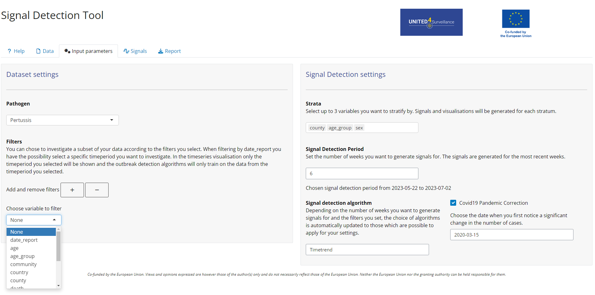
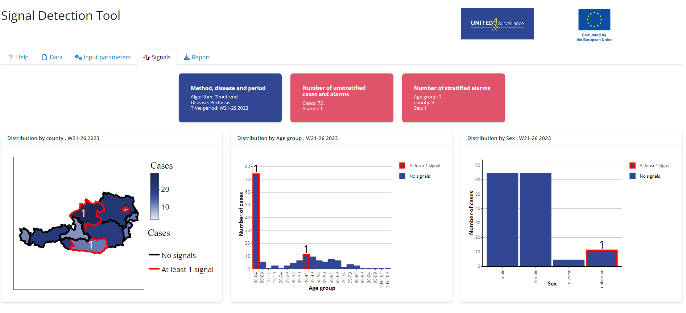
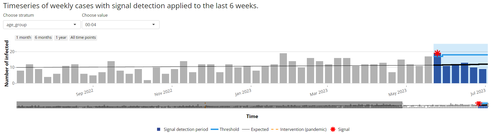
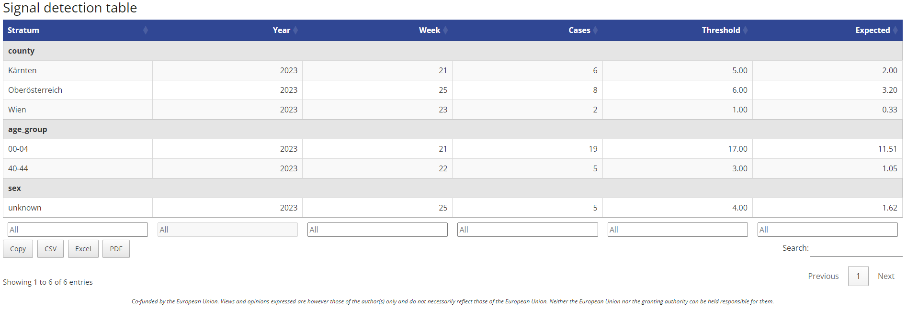

<!-- README.md is generated from README.Rmd. Please edit that file -->

# SignalDetectionTool

<!-- badges: start -->
<!-- badges: end -->

## Overview

A shiny app for automated detection of signals in infectious disease
surveillance data. A signal is an anomaly in an infectious disease
surveillance time series.  
This app allows the user to investigate generated signals and
corresponding surveillance time series. It includes upload of csv or
Excel files, data checks, possibility to set parameters for signal
detection, visualisation of results and generation of reports. The tool
is interactive and flexible so that it can be used in different contexts
and customised to the user’s needs.

## Installation and running the app

You can install the most recent release of the SignalDetectionTool from
[GitHub](https://github.com/United4Surveillance/signal-detection-tool)
with:

``` r
# install.packages("devtools")
devtools::install_github("United4Surveillance/signal-detection-tool")
```

To run the app you need to type:

``` r
library(SignalDetectionTool)
run_app()
```

Another way to install the tool is downloading the appropriate file
found under
[Releases](https://github.com/United4Surveillance/signal-detection-tool/releases).

<details>
<summary>
<strong>Detailed Installation Guideline for the Files in
Releases</strong>
</summary>
<ul>
<li>
<strong>Navigating to the Release Page</strong>
<ul>
<li>
Scroll up and look on the right-hand side of the page under a section
labelled <strong>Releases</strong>.
</li>
<li>
Click on <strong>Releases</strong> to access the latest tool release.
</li>
<li>
There are three different files you can download.
</li>
</ul>
</li>

<br>

<details>
<summary>
<strong>Source Code (tar.gz)</strong>
</summary>
<p>
This is a tarball. You must have Rtools installed on your computer to
use this installation method. If you only want to run the app and use
its functionalities, this is the correct installation for you. In case
you are interested in modifying the code of the app, go to
<strong>Source Code (zip)</strong>.
</p>
<ul>
<li>
Download the provided <code>.tar.gz</code> file and save it on your
computer.
</li>
<li>
Install the package <code>remotes</code> by putting
<code>install.packages(“remotes”)</code> in the console.
</li>
<li>
Install the package dependencies for the SignalDetectionTool using the
full path where you stored the <code>.tar.gz</code> file. Replace
<code>x.x.x</code> with the current version of the binary. For example:
<code>remotes::install_deps(“C:/Users/YourUsername/Downloads/SignalDetectionTool_x.x.x.tar.gz”)</code>
</li>
<li>
Execute this command in the console.
</li>
<li>
This should also install any dependencies you need to run the tool. Wait
until the installation finishes successfully.
</li>
<li>
Write the following command into the console to install the tool:
<code>install.packages(“path_to_the_tool/SignalDetectionTool_x.x.x.tar.gz”,
repos = NULL, type=“source”)</code>
</li>
<li>
Go back above the detailed installation instructions to read how to run
the app.
</li>
</ul>
</details>
<details>
<summary>
<strong>SignalDetectionTool_x.x.x.zip</strong>
</summary>
<p>
This is a binary. You do not need to have Rtools installed on your
computer to use this installation method.
</p>
<ul>
<li>
Download the provided <code>.zip</code> file and save it on your
computer (do NOT unzip). Open RStudio.
</li>
<li>
Install the package <code>remotes</code> by putting
<code>install.packages(“remotes”)</code> in the console.
</li>
<li>
Install the package dependencies for the SignalDetectionTool using the
full path where you stored the <code>.zip</code> file. Replace
<code>x.x.x</code> with the current version of the binary. For example:
<code>remotes::install_deps(“C:/Users/YourUsername/Downloads/SignalDetectionTool_x.x.x.binary.zip”)</code>
</li>
<li>
Execute this command in the console.
</li>
<li>
This command will ask if you want to update your installed packages.
Type <code>1</code> and press enter to install the updates. For advanced
users, you can also install only the minimal required versions written
inside the <code>DESCRIPTION</code> file by using
<code>remotes::install_version()</code>.
</li>
<li>
Install the SignalDetectionTool with:
<code>install.packages(“your_path_to_the_zip/SignalDetectionTool_x.x.x_binary.zip”)</code>.
</li>
<li>
Go back above the detailed installation instructions to read how to run
the app.
</li>
</ul>
</details>
<details>
<summary>
<strong>Source Code (zip)</strong>
</summary>
<p>
This is a zipped folder of the SignalDetectionTool repository. You must
have Rtools installed on your computer to use this installation method.
It can be unzipped and installed over the ‘Build’ tab in RStudio. This
is ideal if you want to modify the app’s code. Alternatively, you can
clone the repository.
</p>
<ul>
<li>
Download the provided <code>.zip</code> file and save it on your
computer.
</li>
<li>
Go into the unzipped SignalDetectionTool folder and double-click on the
<code>SignalDetectionTool.Rproj</code> file to open it.
</li>
<li>
Install packages via RStudio’s suggestion (click ‘Install’) or copy this
line into the console: <code>devtools::install_deps()</code>.
</li>
<li>
The command may ask if you want to update your installed packages. Type
<code>1</code> and press enter to install updates.
</li>
<li>
For advanced users, install minimal required versions from the
<code>DESCRIPTION</code> file using
<code>remotes::install_version()</code>.
</li>
<li>
If <code>devtools::install_deps()</code> gives an error (e.g., ‘no
package called devtools’), install it with:
<code>install.packages(“devtools”)</code>, then run the command again.
</li>
<li>
To install the SignalDetectionTool, go to RStudio’s ‘Build’ tab (top
right window) and click ‘Install’.
</li>
<li>
Go back above the detailed installation instructions to read how to run
the app.
</li>
</ul>
</details>
</details>

## Usage

The shiny application is structured into a **Help**, **Data**, **Input
parameters**, **Signals** and **Report** tab.  
You can try the shiny application yourself using [test
data](https://github.com/United4Surveillance/signal-detection-tool/blob/main/dev/data/input/input.csv)
provided with the package.

### Help

The Help tab provides more information to the user how to use the app
and details about settings in the individual tabs and signal detection
algorithms.

### Data

[Here](https://github.com/United4Surveillance/signal-detection-tool/blob/main/dev/data/input/description.md)
is the description of the required data format to use the app. The input
format is a line list of infectious disease cases. In the data tab the
user can upload surveillance data (Excel or csv) for which the signal
detection should be performed. A data format check is automatically run
once the data file has been uploaded and feedback is provided to the
user. Alternatively you can also view the required input format using:

``` r
library(SignalDetectionTool)
View(input_metadata)
```

### Input parameters

In the Input parameters tab you can configure the signal detection you
want to perform. You can specify filters, stratification variables, time
periods and the signal detection algorithm which should be used. For
some algorithms, a pandemic correction can be applied, incorporating an
interrupted time series analysis into the outbreak detection methods.


### Signals

The Signals tab can look like this when using the test data and
stratification by age group, county and sex and using a timetrend
algorithm with pandemic correction:




### Report

In the Report tab HTML and Word reports can be generated showing the
results of the Signals Tab. Reports can also be generated using the
`run_report()` function.

## Development Process and Contribution

The tool development is an open source development process. The
participants of Work Package 2.2 of the [United4Surveillance
project](https://united4surveillance.eu/) will be the maintainers of the
repository and can contribute directly, third parties can contribute via
pull requests. The maintainers are meeting regularly to discuss pull
requests, issues and to add new issues according to the collected
requirements. Maintainers and contributors can work independently on
issues. For more information on how to contribute, please see our
[contributing
guidelines](https://github.com/United4Surveillance/signal-detection-tool/blob/main/.github/CONTRIBUTING.md).

## Roadmap

The initial version of the tool (0.1.0) was deployed in April 2024 to
eleven European public health institutes for piloting. The official
piloting phase ended in November 2024. The tool can and is used after
November 2024 and will still be developed further.<br> Some key features
we want to develop are:

- possibility to aggregate the time series on different levels
  i.e. daily, biweekly, monthly,…
- possibility to combine stratifications
- retrieve linelist with cases corresponding to signals generated
