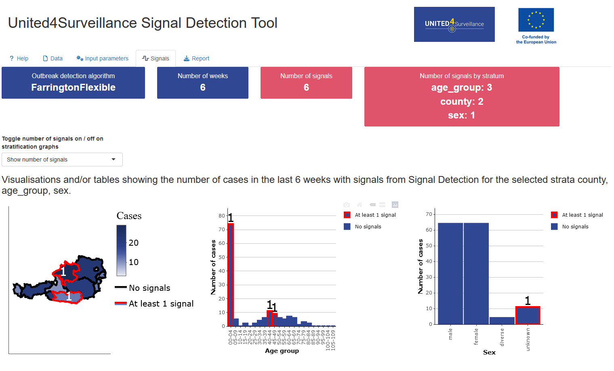
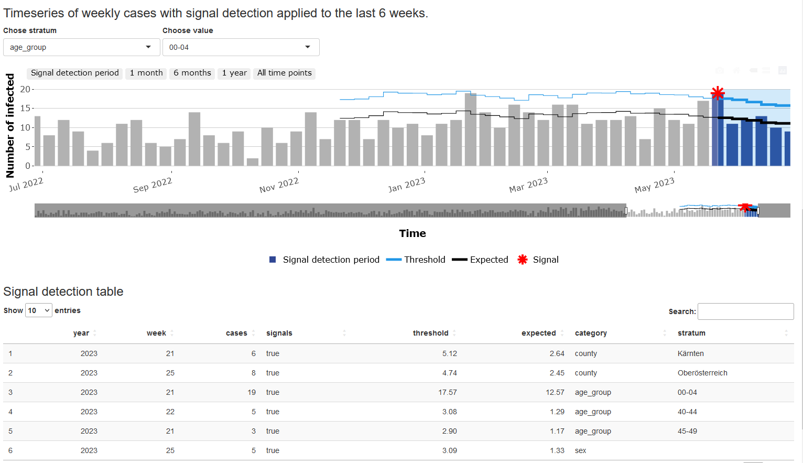

<!-- README.md is generated from README.Rmd. Please edit that file -->

# SignalDetectionTool

<!-- badges: start -->
<!-- badges: end -->

## Overview

A shiny app for automated detection of signals in infectious disease
surveillance data. A signal is an anomaly in an infectious disease
surveillance time series.  
This app allows the user to investigate generated signals and
corresponding surveillance time series. It includes upload of csv or
Excel files, data checks, possibility to set parameters for signal
detection, visualisation of results and generation of reports. The tool
is interactive and flexible so that it can be used in different contexts
and customised to the user’s needs.

## Installation

You can install the development version of SignalDetectionTool from
[GitHub](https://github.com/United4Surveillance/signal-detection-tool)
with:

``` r
# install.packages("devtools")
devtools::install_github("United4Surveillance/signal-detection-tool")
```

## Usage

The shiny application is structured into a **Help**, **Data**, **Input
parameters**, **Signals** and **Report** tab.  
You can try the shiny application yourself using test data provided with
the package. The test data is found in dev/data/input/input.csv.

### Help

The Help tab provides more information to the user how to use the app
and details about settings in the individual tabs and signal detection
algorithms.

### Data

In the Data tab the user can upload the surveillance data for which the
signal detection should be performed. The input format is a line list of
infectious disease cases and the tool accepts data in the predefined
format described in dev/data/input/description.md. A data format check
is automatically run once the data file has been uploaded. You can also
view the required input format using

``` r
library(SignalDetectionTool)
View(input_metadata)
```

### Input parameters

In the Input parameters tab you can configure the signal detection you
want to perform. You can specify filters, stratification variables, time
periods and the signal detection algorithm which should be used.


### Signals

The Signals tab can look like this when using the test data and
stratificaton by age group, county and sex.



### Report

In the Report tab HTML and Word reports can be generated showing the
results of the Signals Tab.

## Development Process and Contribution

The tool development is an open source development process.

The participants of Work Package 2.2 of the [United4Surveillance
project](https://united4surveillance.eu/) will be the maintainers of the
repository and can contribute directly, third parties can contribute via
pull requests.

The maintainers will meet regularly and discuss pull request, issues and
add new issues according to the collected requirements.

Maintainers and contributers can work indepedently on issues.

For more information on how to contribute, please see our [contributing
guidelines](https://github.com/United4Surveillance/signal-detection-tool/blob/main/.github/CONTRIBUTING.md).

## Roadmap

The first version 0.1.0 of the tool was provided to european public
health institutes for piloting in April 2024. The piloting phase ends in
November 2024.  
Our goal is to get as much feedback from the piloting countries as
possible. Therefore, we adopt an agile development approach with the aim
to ship improved versions as often and as early as possible. Some of the
current features we want to develop are:

- possibility to aggregate the time series on different levels
  i.e. daily, biweekly, monthly,…
- integrate algorithms with possibility to correct for pandemic
- possibility to combine stratifications
- retrieve linelist with cases corresponding to signals generated
